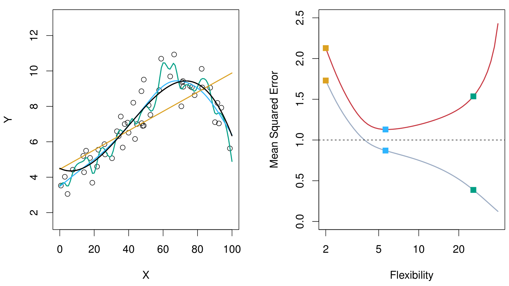
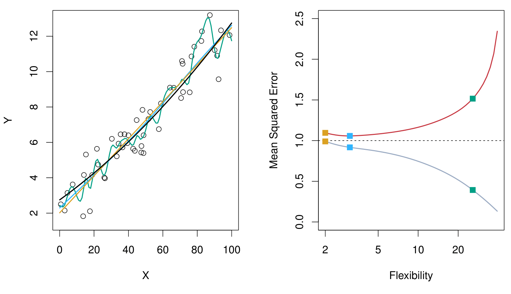
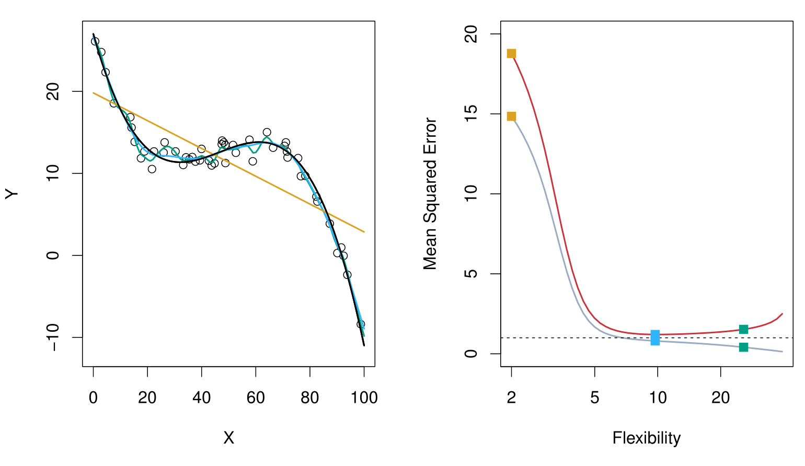
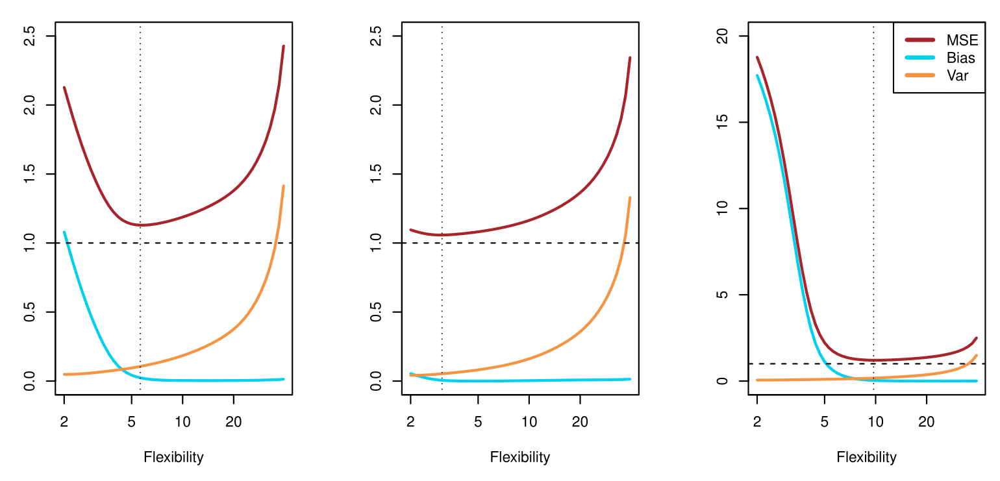

```{python setup}
#| include: false
import pandas as pd
import numpy as np
import matplotlib.pyplot as plt
import plotnine as p9
import plotly.express as px
import plotly.graph_objects as go
from itables import show
import pyreadr
from pyhere import here
```

## Concept Check

What do we call these:

-   $\mathbf{X}$
-   $Y$

What is our goal in supervised learning?

## Concept Check

-   Features: $\mathbf{X}$
-   Target: $Y$
-   Goal: Predict $Y$ using $\mathbf{X}$

. . .

-   What do we call this process if $Y$ is numerical? What about categorical?

## Concept Check

-   What do we call this process if $Y$ is numerical? What about categorical?
    +   Numerical: regression
    +   Categorical: classification
    
. . .

-   What is the difference between a training and a test set?
-   How do we evaluate the performance of a regression model?

# Bias-Variance Trade-Off

## Supervised Learning: Assessing Model Performance {.smaller}

::: {style="font-size: 75%;"}
-   Labeled training data $(x_1,y_1), (x_2, y_2), \ldots, (x_n,y_n)$
    -   i.e. $n$ training observations
-   Fit/train a model from training data
    -   $\hat{y}=\hat{f}(x)$, regression
    -   $\hat{y}=\hat{C}(x)$, classification\
-   Obtain estimates $\hat{f}(x_1), \hat{f}(x_2), \ldots, \hat{f}(x_n)$
    (or, $\hat{C}(x_1), \hat{C}(x_2), \ldots, \hat{C}(x_n)$) of training
    data
-   Compute error:
    -   **Regression**
        $$\text{Training MSE}=\text{Average}_{Training} \left(y-\hat{f}(x)\right)^2 = \frac{1}{n} \displaystyle \sum_{i=1}^{n} \left(y_i-\hat{f}(x_i)\right)^2$$
    -   **Classification** $$
        \begin{aligned}
        \text{Training Error Rate}
        &=\text{Average}_{Training} \ \left[I \left(y\ne\hat{C}(x)\right) \right]\\
        &= \frac{1}{n} \displaystyle \sum_{i=1}^{n} \ I\left(y_i \ne \hat{C}(x_i)\right)
        \end{aligned}
        $$
:::

## Supervised Learning: Assessing Model Performance {.smaller}

-   In general, not interested in performance on training data
-   Want: performance on unseen test data... why?
-   Fresh test data:
    $(x_1^{test},y_1^{test}), (x_2^{test},y_2^{test}), \ldots, (x_m^{test},y_m^{test})$.
-   Compute test error:
    -   **Regression**
        $$\text{Test MSE}=\text{Average}_{Test} \left(y-\hat{f}(x)\right)^2 = \frac{1}{m} \displaystyle \sum_{i=1}^{m} \left(y_i^{test}-\hat{f}(x_i^{test})\right)^2$$
    -   **Classification**
        $$\text{Test Error Rate}=\text{Average}_{Test} \ \left[I \left(y\ne\hat{C}(x)\right) \right]= \frac{1}{m} \displaystyle \sum_{i=1}^{m} \ I\left(y_i^{test} \ne \hat{C}(x_i^{test})\right)$$

## Supervised Learning: Bias-Variance Trade-off {.smaller}

-   Model fit on training data $\hat{f}(x)$
-   "True" relationship: $Y=f(x)+\epsilon$
-   $(x_0^{test}, y_0^{test})$: test observation
-   [Bias-Variance Trade-Off (Theoretical)](https://efriedlander.shinyapps.io/BVTappRegression/)
    $$\underbrace{E\left(y_0^{test}-\hat{f}(x_0^{test})\right)^2}_{total \ error}=\underbrace{Var\left(\hat{f}(x_0^{test})\right)}_{source \ 1} + \underbrace{\left[Bias\left(\hat{f}(x_0^{test})\right)\right]^2}_{source \ 2}+\underbrace{Var(\epsilon)}_{source \ 3}$$
    where
    $Bias\left(\hat{f}(x_0)\right)=E\left(\hat{f}(x_0)\right)-f(x_0)$

. . .

-   Question: Where is $\hat{y}_0^{test}$?

## Supervised Learning: Bias-Variance Trade-off

-   Reducible Error:
    -   Source 1: how $\hat{f}(x)$ varies among different randomly
        selected possible training data (**Variance**)
    -   Source 2: how $\hat{f}(x)$ (when predicting the test data)
        differs from its target $f(x)$ (**Bias**)
-   Irreducible Error:
    -   Source 3: how $y$ differs from "true" $f(x)$

## Bias-Variance Trade-off: Example {.smaller}

-   For now: focus on regression problems (ideas extend to
    classification)
-   Consider: three different examples of simulated "toy" datasets and
    three types of models ($\hat{f}_i(.)$)
    +   Linear Regression [**orange**]{style="color:orange"}
    +   Smoothing Spline 1 [**blue**]{style="color:cornflowerblue"}
    +   More flexible Smoothing Spline 2
        [**green**]{style="color:green"}
-   "True" (simulated) function $f(.)$ [**black**]{style="color:black"}
-   [**Training Error**]{style="color:grey"}
-   [**Test Error**]{style="color:red"}

## Bias-Variance Trade-off: Example



## Bias-Variance Trade-off: Example



## Bias-Variance Trade-off: Example



## Bias-Variance Trade-off: Example




# Linear Regression

## A Familiar Supervised Learning Model {.smaller}

- Assume relationship between $\mathbf{X}$ and $Y$ is:
$$Y=f(\mathbf{X}) + \epsilon$$
where $\epsilon$ is a **random** error term (includes measurement error, other discrepancies) independent of $\mathbf{X}$ and has mean zero.
- **Objective**: To approximate/estimate $f(\mathbf{X})$
- **Linear Regression**: assume that $f(\mathbf{X})$ is a linear function of $\mathbf{X}$
  + For $p=1$: $f(\mathbf{X}) = \beta_0 + \beta_1 X_1$
  + For $p > 1$: $f(\mathbf{X}) = \beta_0 + \beta_1 X_1 + \cdots + \beta_p X_p$

## Linear Regression {.smaller}

Suppose the CEO of a restaurant franchise is considering opening new outlets in different cities. They would like to expand their business to cities that give them higher profits with the assumption that highly populated cities will probably yield higher profits.

They have data on the population (in 100,000) and profit (in $1,000) at 97 cities where they currently have outlets.

```{python}
#| echo: false
outlets = pd.read_csv(here("data/outlets.csv"))
show(outlets.head())
```

## Linear Regression

- **Objective**: choose "best" $\beta_0$ and $\beta_1$ if we assume
$$\text{profit} = \beta_0 + \beta_1\times\text{population}$$
- Once this is done, we can:
  + predict the profit for a new city with a given population
  + understand the relationship between `population` and `profit` better

## Outlet EDA

Practice!

## Linear Regression: Estimating Parameters {.smaller}

::: {.incremental}
- Suppose we have $\hat{\beta}_0$ and $\hat{\beta}_1$
- Observed response: $y_i$ for $i=1,\ldots,n$
- Predicted response: $\hat{y}_i$ for $i=1, \ldots, n$
- Residual: $e_i = y_i - \hat{y}_i$ for $i=1, \ldots, n$
- **Mean Squared Error (MSE)**: $MSE =\dfrac{e^2_1+e^2_2+\ldots+e^2_n}{n}$  also known as the **loss/cost function**
- **GOAL**: Find $\hat{\beta}_0$ and $\hat{\beta}_1$ which minimizes $MSE$
:::


## Gradient Descent Algorithm

- How do we minimize the $MSE$?
  + Can be done "analytically" but most ML models can't be fit that way
- **Today**: popular optimization algorithm called **gradient descent**.
- **NOTE**: Gradient Descent is not a machine learning model/algorithm. It is an optimization technique that helps to fit machine learning models.

## Gradient Descent Algorithm {.smaller}

- Think of the MSE as a function of $\hat{\beta}_0$ and $\hat{\beta}_1$
  + $\text{MSE} = \frac{\sum (y_i - (\hat{\beta}_0 + \hat{\beta}_1 x_i))^2}{n}$

```{python}
#| echo: false

centerb0 = -4
centerb1 = 1
b0_width = 500
b1_width = 50

b0 = np.linspace(-b0_width + centerb0, b0_width + centerb0, 101)
b1 = np.linspace(-b1_width + centerb1, b1_width + centerb1, 101)

B1, B0 = np.meshgrid(b1, b0)

def calc_mse(b0s, b1s):
    return np.mean((outlets['profit'] - b0s - b1s * outlets['population'])**2)

v_calc_mse = np.vectorize(calc_mse)
grid_mat = v_calc_mse(B0, B1)

min_val = np.min(grid_mat)
max_val = min_val + 0.04 * (np.max(grid_mat) - np.min(grid_mat))

fig = go.Figure(data=[go.Surface(z=grid_mat, x=b1, y=b0, cmin=min_val, cmax=max_val, opacity=0.7)])

fig.update_layout(
    scene=dict(
        xaxis=dict(range=[min(b1), max(b1)], title=r"$\beta_1$"),
        yaxis=dict(range=[min(b0), max(b0)], title=r"$\beta_0$"),
        zaxis=dict(range=[min_val, max_val], title="MSE")
    )
)

fig.show()
```

## Gradient Descent Algorithm {.smaller .scrollable}

```{python}
#| echo: false

# create data to plot
x = np.arange(-5, 5.05, 0.05)
y = x**2 + 3
df = pd.DataFrame({'x': x, 'y': y})

step_indices = [4] # adjusted for 0-indexing
step_size = 0.2
min_idx = df['y'].idxmin()

for _ in range(18):
    last_idx = step_indices[-1]
    next_idx = int(last_idx + np.round((min_idx - last_idx) * step_size))
    step_indices.append(next_idx)

steps = df.iloc[step_indices].copy()
steps['x2'] = steps['x'].shift(1)
steps['y2'] = steps['y'].shift(1)
steps_filtered = steps.iloc[0:18]

# plot
p = (p9.ggplot(df, p9.aes('x', 'y'))
 + p9.geom_line(size=1.5, alpha=0.5)
 + p9.geom_point(p9.aes(x=steps['x'].iloc[0], y=steps['y'].iloc[0]), size=3, shape='o', fill="blue", alpha=0.5)
 + p9.theme_classic()
 + p9.scale_y_continuous(name="Cost/Loss function (MSE)", limits=(0, 30))
 + p9.xlab("parameter to estimate")
)
p.show()
```

Updates to the parameter:
$$
\begin{aligned}
\text{new value of parameters} &= \text{old value of parameters}\\
&\qquad- \text{step size} \times \text{gradient of function w.r.t. parameters}
\end{aligned}
$$

## Gradient Descent Algorithm

```{python}
#| echo: false

def get_bezier_curve(x1, y1, x2, y2, curvature=0.2, points=20, x_range=1, y_range=1, visual_aspect=3.0):
    """
    Create a bezier curve between two points with visually symmetric curvature.
    
    visual_aspect: width/height ratio of the plot as rendered (e.g., 3.0 for a 3:1 aspect ratio)
    """
    t = np.linspace(0, 1, points)
    # Midpoint
    mx, my = (x1 + x2) / 2, (y1 + y2) / 2
    
    # Convert to visual coordinates (where 1 unit = same visual distance on both axes)
    # visual_x = data_x * (visual_width / x_range) 
    # visual_y = data_y * (visual_height / y_range)
    # If visual_aspect = visual_width / visual_height, then:
    # visual_x = data_x * visual_aspect / x_range
    # visual_y = data_y / y_range
    scale_x = visual_aspect / x_range
    scale_y = 1.0 / y_range
    
    x1_vis, x2_vis = x1 * scale_x, x2 * scale_x
    y1_vis, y2_vis = y1 * scale_y, y2 * scale_y
    mx_vis, my_vis = mx * scale_x, my * scale_y
    
    # Direction and perpendicular in visual space
    dx_vis = x2_vis - x1_vis
    dy_vis = y2_vis - y1_vis
    dist_vis = np.sqrt(dx_vis**2 + dy_vis**2)
    
    if dist_vis == 0:
        return pd.DataFrame({'x': x1, 'y': y1}, index=range(points))
    
    # Perpendicular unit vector in visual space
    perp_x_vis = -dy_vis / dist_vis
    perp_y_vis = dx_vis / dist_vis
    
    # Control point in visual space
    cx_vis = mx_vis + curvature * dist_vis * perp_x_vis
    cy_vis = my_vis + curvature * dist_vis * perp_y_vis
    
    # Convert control point back to data space
    cx = cx_vis / scale_x
    cy = cy_vis / scale_y
    
    # Bezier formula: B(t) = (1-t)^2 P0 + 2(1-t)t P1 + t^2 P2
    bx = (1-t)**2 * x1 + 2*(1-t)*t * cx + t**2 * x2
    by = (1-t)**2 * y1 + 2*(1-t)*t * cy + t**2 * y2
    
    return pd.DataFrame({'x': bx, 'y': by})

# plot
curve_data = pd.DataFrame()
x_range = df['x'].max() - df['x'].min()
y_range = 30
for i, row in steps.dropna().iterrows():
    # Adjust curvature based on direction or just keep constant for simple "arc" look
    # R geom_curve uses a curvature parameter. A value of 0.5 gives a nice arc.
    segment = get_bezier_curve(row['x'], row['y'], row['x2'], row['y2'], curvature=-0.5, x_range=x_range, y_range=y_range)
    segment['group'] = i
    curve_data = pd.concat([curve_data, segment])

p = (p9.ggplot(df, p9.aes('x', 'y'))
 + p9.geom_line(size=1.5, alpha=0.5)
 + p9.theme_classic()
 + p9.scale_y_continuous(name="Cost/Loss function (MSE)", limits=(0, 30))
 + p9.xlab("parameter to estimate")
 + p9.geom_segment(data=df.iloc[[4, min_idx]], mapping=p9.aes(x='x', y='y', xend='x', yend=-np.inf), linetype="dashed")
 + p9.geom_point(data=df.loc[df['y'] == df['y'].min()], mapping=p9.aes('x', 'y'), size=4, shape='o', fill="yellow")
 + p9.geom_point(data=steps, mapping=p9.aes('x', 'y'), size=3, shape='o', fill="blue", alpha=0.5)
 + p9.geom_path(data=curve_data, mapping=p9.aes('x', 'y', group='group'), linetype="dotted")
 + p9.theme(axis_ticks=p9.element_blank(), axis_text=p9.element_blank())
 + p9.annotate("text", x=df.iloc[4]['x'], y=1, label="initial value", ha='left', va='top')
 + p9.annotate("text", x=df.iloc[min_idx]['x'], y=1, label="minimium", ha='left', va='top')
 + p9.annotate("text", x=df.iloc[4]['x'], y=df.iloc[4]['y'], label="learning rate (step size)", ha='left', va='bottom')
)
p.show()
```

## Gradient Descent Algorithm {.smaller}

```{python}
#| echo: false
#| layout-ncol: 2
#| fig-subcap: 
#|   - "Step size too small"
#|   - "Step size too too big"

# create too small of a learning rate
step_indices_small = [4]
step_size_small = 0.05

for _ in range(10):
    last_idx = step_indices_small[-1]
    next_idx = int(last_idx + np.round((min_idx - last_idx) * step_size_small))
    step_indices_small.append(next_idx)

too_small = df.iloc[step_indices_small].copy()
too_small['x2'] = too_small['x'].shift(1)
too_small['y2'] = too_small['y'].shift(1)

curve_data_small = pd.DataFrame()
x_range = df['x'].max() - df['x'].min()
y_range = 30
for i, row in too_small.dropna().iterrows():
    segment = get_bezier_curve(row['x'], row['y'], row['x2'], row['y2'], curvature=-0.5, x_range=x_range, y_range=y_range)
    segment['group'] = i
    curve_data_small = pd.concat([curve_data_small, segment])

# plot small
p_small = (p9.ggplot(df, p9.aes('x', 'y'))
 + p9.geom_line(size=1.5, alpha=0.5)
 + p9.theme_classic()
 + p9.scale_y_continuous(name="Cost/Loss function of the variable", limits=(0, 30))
 + p9.xlab("variable")
 + p9.geom_segment(data=too_small.iloc[[0]], mapping=p9.aes(x='x', y='y', xend='x', yend=-np.inf), linetype="dashed")
 + p9.geom_point(data=too_small, mapping=p9.aes('x', 'y'), size=3, shape='o', fill="blue", alpha=0.5)
 + p9.geom_path(data=curve_data_small, mapping=p9.aes('x', 'y', group='group'), linetype="dotted")
 + p9.theme(axis_ticks=p9.element_blank(), axis_text=p9.element_blank())
 + p9.annotate("text", x=df.iloc[4]['x'], y=1, label="initial value", ha='left', va='top')
)
p_small.show()

# create too large of a learning rate
too_large_indices = [int(np.round(min_idx * (1 + offset))) for offset in [-0.9, -0.6, -0.2, 0.3]]
too_large_indices = [max(0, min(len(df)-1, idx)) for idx in too_large_indices]

too_large = df.iloc[too_large_indices].copy()
too_large['x2'] = too_large['x'].shift(1)
too_large['y2'] = too_large['y'].shift(1)

curve_data_large = pd.DataFrame()
for i, row in too_large.dropna().iterrows():
    segment = get_bezier_curve(row['x'], row['y'], row['x2'], row['y2'], curvature=-0.5, x_range=x_range, y_range=y_range)
    segment['group'] = i
    curve_data_large = pd.concat([curve_data_large, segment])

# plot large
p_large = (p9.ggplot(df, p9.aes('x', 'y'))
 + p9.geom_line(size=1.5, alpha=0.5)
 + p9.theme_classic()
 + p9.scale_y_continuous(name="Cost/Loss function of the variable", limits=(0, 30))
 + p9.xlab("variable")
 + p9.geom_segment(data=too_large.iloc[[0]], mapping=p9.aes(x='x', y='y', xend='x', yend=-np.inf), linetype="dashed")
 + p9.geom_point(data=too_large, mapping=p9.aes('x', 'y'), size=3, shape='o', fill="blue", alpha=0.5)
 + p9.geom_path(data=curve_data_large, mapping=p9.aes('x', 'y', group='group'), linetype="dotted")
 + p9.theme(axis_ticks=p9.element_blank(), axis_text=p9.element_blank())
 + p9.annotate("text", x=too_large.iloc[0]['x'], y=1, label="initial value", ha='left', va='top')
)
p_large.show()
```

## Gradient Descent for Linear Regression {.smaller}

- **Objective**: We want to find $\hat{\beta}_0$ and $\hat{\beta}_1$ which minimizes
- $$\begin{aligned}
MSE &= \dfrac{e^2_1+e^2_2+\ldots+e^2_n}{n}\\ 
&= \dfrac{(y_1 - \hat{y}_1)^2 +  (y_2 - \hat{y}_2)^2 + \ldots + (y_n - \hat{y}_n)^2}{n}
\end{aligned}$$
- $$MSE = \dfrac{(y_1 - (\hat{\beta}_0 + \hat{\beta}_1 \ x_1))^2 +  (y_2 - (\hat{\beta}_0 + \hat{\beta}_1 \ x_2))^2 + \ldots + (y_n - (\hat{\beta}_0 + \hat{\beta}_1 \ x_n))^2}{n}$$
- $$MSE = \displaystyle \dfrac{1}{n}\sum_{i=1}^{n} (y_i - (\hat{\beta}_0 + \hat{\beta}_1 \ x_i))^2 = \displaystyle \dfrac{1}{n}\sum_{i=1}^{n} (y_i - \hat{y}_i)^2 = \displaystyle \dfrac{1}{n}\sum_{i=1}^{n} (e_i)^2$$

## Gradient Descent for Linear Regression {.smaller}

- To compute gradient, need partial derivatives of $MSE$ with respect to $\hat{\beta}_0$ and $\hat{\beta}_1$.
- $$\text{partial derivative of MSE w.r.t.} \ \hat{\beta}_0 = -\dfrac{2}{n} \displaystyle \sum_{i=1}^{n} (y_i - (\hat{\beta}_0 + \hat{\beta}_1 \ x_i)) = -\dfrac{2}{n} \displaystyle \sum_{i=1}^{n} (y_i - \hat{y}_i)$$
- $$\text{partial derivative of MSE w.r.t.} \ \hat{\beta}_1 = -\dfrac{2}{n} \displaystyle \sum_{i=1}^{n} x_i (y_i - (\hat{\beta}_0 + \hat{\beta}_1 \ x_i)) = -\dfrac{2}{n} \displaystyle \sum_{i=1}^{n} x_i (y_i - \hat{y}_i)$$

## Gradient Descent for Linear Regression {.smaller}

- Gradient descent update:
  + For $\hat{\beta}_0$:
    $$
    \begin{aligned}
    \hat{\beta}_0 \ \text{(new)} 
    &= \hat{\beta}_0 \ \text{(old)}- \bigg(\text{step size} \times \text{derivative w.r.t} \ \hat{\beta}_0\bigg)\\ 
    &= \hat{\beta}_0 \ \text{(old)} + \bigg(\text{step size} \times \dfrac{2}{n} \displaystyle \sum_{i=1}^{n} (y_i - \hat{y}_i)\bigg)
    \end{aligned}
    $$
  + For $\hat{\beta}_1$:
  $$
  \begin{aligned}
  \hat{\beta}_1  \ \text{(new)} &= \hat{\beta}_1  \ \text{(old)} - \bigg(\text{step size} \times \text{derivative w.r.t} \ \hat{\beta}_1 \bigg)\\
  &= \hat{\beta}_1  \ \text{(old)} + \bigg(\text{step size} \times \dfrac{2}{n} \displaystyle \sum_{i=1}^{n} x_i (y_i - \hat{y}_i)\bigg)
  \end{aligned}
  $$

## Recap

-   **Bias-Variance Trade-off**: Total error is composed of variance, (squared) bias, and irreducible error.
-   **Linear Regression**: Assumes a linear relationship between features and target.
-   **Loss Function**: Usually Mean Squared Error (MSE) for regression.
-   **Gradient Descent**: An optimization algorithm that iteratively updates parameters to minimize the loss function.
-   **Learning Rate**: Controls the size of the steps taken during gradient descent.


