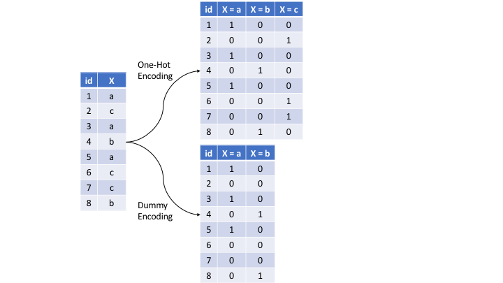

## Computational Set-Up

```{python}
import pandas as pd
import numpy as np
import matplotlib.pyplot as plt
import seaborn as sns
from sklearn.model_selection import train_test_split, KFold, cross_validate
from sklearn.linear_model import LinearRegression
from sklearn.neighbors import KNeighborsRegressor
from sklearn.pipeline import Pipeline
from sklearn.preprocessing import StandardScaler, OneHotEncoder, OrdinalEncoder
from sklearn.feature_selection import VarianceThreshold
from sklearn.compose import ColumnTransformer
from sklearn.metrics import mean_squared_error, r2_score
from plotnine import *
from itables import show
import warnings

warnings.filterwarnings('ignore')
np.random.seed(4025)
```

# Pre-processing

## Data: Ames Housing Prices {.smaller}

Goal: Predict `Sale_Price`.

```{python}
ames = pd.read_csv("../data/ameshousing.csv")
ames.info()
```

## Today

We'll cover some common pre-processing tasks:

- Dealing with zero-variance (zv) and/or near-zero variance (nzv) variables
- Imputing missing entries (Next Lecture)
- Label encoding ordinal categorical variables
- Standardizing (centering and scaling) numeric predictors
- Lumping predictors
- One-hot/dummy encoding categorical predictor

## Pre-Split Cleaning {.smaller}

- Before you split your data: make sure data is in correct format
- This may mean different things for different data sets
- Common examples:
    + Fixing names of columns
    + Ensure all variable types are correct
    + Ensure all factor levels are correct and in order (if applicable)
    + Remove any variables that are not important (or harmful) to your analysis
    + Ensure missing values are coded as such (i.e. as `NaN` instead of 0 or -1 or "missing")
    + Filling in missing values where you know what the answer should be (i.e. if a missing value really means 0 instead of missing)

## Example: Factor Levels in Wrong Order

```{python}
ames['Overall_Qual'].unique()
```

## Re-Factoring (Ordinal Encoding)

```{python}
# Pandas approach
qual_levels = ["Very_Poor", "Poor", "Fair", "Below_Average", "Average", 
               "Above_Average", "Good", "Very_Good", "Excellent", "Very_Excellent"]

ames['Overall_Qual'] = pd.Categorical(ames['Overall_Qual'], categories=qual_levels, ordered=True)
ames['Overall_Qual'].cat.categories
```

Note: In `scikit-learn`, you can use `OrdinalEncoder` in a pipeline if you want this step integrated into your workflow.

## Zero-Variance (zv) and/or Near-Zero Variance (nzv) Variables {.smaller}

Heuristic for detecting near-zero variance features is:

- The fraction of unique values over the sample size is low.
- The ratio of the frequency of the most prevalent value to the frequency of the second most prevalent value is large.

We can use `VarianceThreshold` from `sklearn.feature_selection` to automatically remove low-variance features.

## Pipeline: Variance Threshold

```{python}
from sklearn.feature_selection import VarianceThreshold

# Removes any feature with variance below 0.01
var_filter = VarianceThreshold(threshold=0.01)

# In a pipeline
preproc_pipeline = Pipeline([
    ('nzv', VarianceThreshold(threshold=0.01))
])
```

## Encoding Ordinal Features

Two types of categorical features:

-   Ordinal (order is important)
-   Nominal (order is not important)

## Lump Small Categories Together

Some categories may only appear rarely. We can group them into "Other".

```{python}
ames['Neighborhood'].value_counts().head()
```

## Lump Small Categories Together

```{python}
# Calculate frequencies
counts = ames['Neighborhood'].value_counts(normalize=True)
# Find infrequent categories (less than 5%)
infrequent = counts[counts < 0.05].index

# Replace them with 'Other'
ames['Neighborhood'] = ames['Neighborhood'].replace(infrequent, 'Other')
ames['Neighborhood'].value_counts()
```

*Note: There are third-party extensions (like `feature-engine`) that supply `RareLabelEncoder` for adding this behavior easily to scikit-learn pipelines.*

## One-hot/dummy encoding categorical predictors



## Pipeline: Dummy Variables

```{python}
# one_hot=True is the default encoding method in scikit-learn OneHotEncoder
# unless we use drop='first' (dummy encoding)
encoder = OneHotEncoder(drop='first', sparse_output=False, handle_unknown='ignore')
```

## Pipeline: Center and scale

```{python}
scaler = StandardScaler()
```

## Order of Preprocessing Step {.smaller}

Questions to ask:

1. Should this be done before or after data splitting?
2. If I do step_A first what is the impact on step_B? For example, do you want to encode categorical variables before or after normalizing?
3. What data format is required by the model I'm fitting and how will my model react to these changes?
4. Is this step part of my "model"? I.e. is this a decision I'm making based on the data or based on subject matter expertise?
5. Do I have access to my test predictors?

## Questions

-   Should I lump before or after dummy coding?
-   Should I dummy code before or after normalizing?
-   Should I lump before my initial split?
-   How does ordinal encoding impact linear regression vs. KNN?

# Final Python Workflow

## Clean Data Set

```{python}
ames = pd.read_csv("../data/ameshousing.csv")
ames['Overall_Qual'] = pd.Categorical(ames['Overall_Qual'], categories=qual_levels, ordered=True)

# Replace any missing garage types with 'No_Garage' if it makes logical sense
ames['Garage_Type'] = ames['Garage_Type'].fillna('No_Garage')
```

## Initial Data Split

```{python}
ames_train, ames_test = train_test_split(
    ames, 
    train_size=0.75,
    random_state=4025
)

X_train = ames_train.drop(columns=['Sale_Price'])
y_train = ames_train['Sale_Price']
X_test = ames_test.drop(columns=['Sale_Price'])
y_test = ames_test['Sale_Price']
```

## Define Folds

```{python}
kf = KFold(n_splits=10, shuffle=True, random_state=4025)
```

## Define Model(s)

```{python}
lm_model = LinearRegression()
knn5_model = KNeighborsRegressor(n_neighbors=5)
knn10_model = KNeighborsRegressor(n_neighbors=10)
```

## Define Preprocessing

```{python}
numeric_features = X_train.select_dtypes(include=['int64', 'float64']).columns
categorical_features = X_train.select_dtypes(include=['object', 'category']).columns

preprocessor = ColumnTransformer(
    transformers=[
        ('num', Pipeline([
            ('nzv', VarianceThreshold(threshold=0.01)),
            ('scaler', StandardScaler())
        ]), numeric_features),
        ('cat', OneHotEncoder(handle_unknown='ignore'), categorical_features)
    ])
```

## Define Workflows

```{python}
lm_wf = Pipeline([('preprocessor', preprocessor), ('model', lm_model)])
knn5_wf = Pipeline([('preprocessor', preprocessor), ('model', knn5_model)])
knn10_wf = Pipeline([('preprocessor', preprocessor), ('model', knn10_model)])
```

## Fit and Assess Models

```{python}
scoring = {'r2': 'r2', 'neg_mse': 'neg_mean_squared_error'}

lm_res = cross_validate(lm_wf, X_train, y_train, cv=kf, scoring=scoring)
knn5_res = cross_validate(knn5_wf, X_train, y_train, cv=kf, scoring=scoring)
knn10_res = cross_validate(knn10_wf, X_train, y_train, cv=kf, scoring=scoring)
```

## Final Evaluate Model

```{python}
# Re-fit our best theoretical model
final_fit = knn10_wf.fit(X_train, y_train)
test_preds = final_fit.predict(X_test)

final_rmse = np.sqrt(mean_squared_error(y_test, test_preds))
final_r2 = r2_score(y_test, test_preds)
print(f"Test RMSE: {final_rmse:.2f}")
print(f"Test R^2: {final_r2:.4f}")
```

## Tips

-   Can try out different pre-processing to see if it improves your model!
-   Process can be intense for you computer, so might take a while
-   No 100% correct way to do it, although there are some 100% incorrect ways to do it

## Recap {.smaller}

- **Preprocessing Needs**: Prevent information leakage by exclusively using training data parameters.
- **`scikit-learn` Pipeline**: Crucial for bundling preprocessing steps with the estimator. Use it always to prevent data leakage.
- **Common Tasks**:
    + Handling Missing Data: Imputation strategies.
    + Categorical encoding: `OneHotEncoder` (dummies), Ordinal encoding.
    + Numeric features: `StandardScaler` (Z-score scaling).
    + Feature filtering: `VarianceThreshold` (e.g. for Zero Variance).
    + Rare categories: Lumping elements together.
- **Order matters!**: Be mindful of when to apply scaling vs dummy-ing or imputation.
