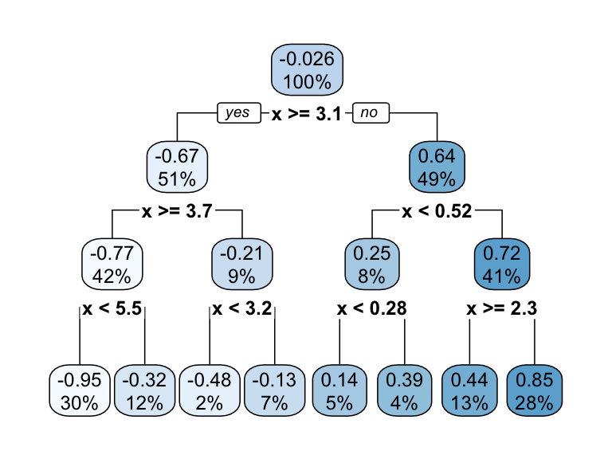
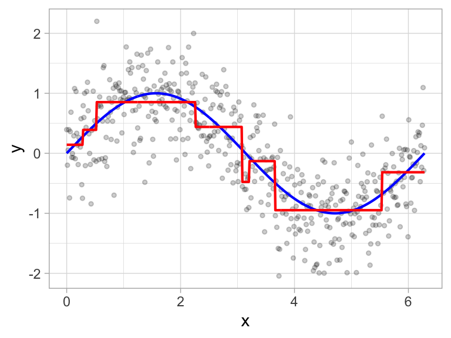
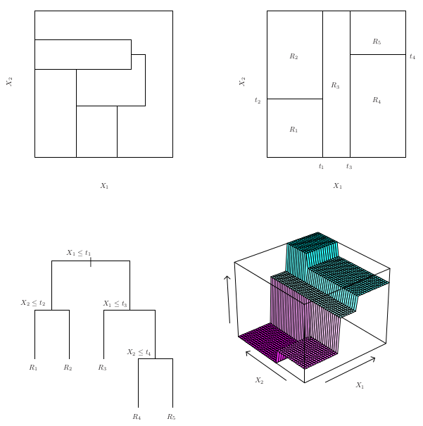
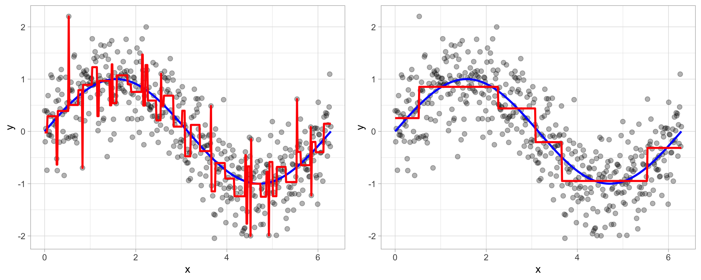

```{python}
#| include: false

import pandas as pd
import numpy as np
import matplotlib.pyplot as plt
from sklearn.tree import DecisionTreeRegressor, plot_tree
from sklearn.model_selection import train_test_split, KFold, GridSearchCV
from sklearn.preprocessing import OrdinalEncoder, OneHotEncoder
from sklearn.compose import ColumnTransformer
from sklearn.pipeline import Pipeline
from sklearn.metrics import root_mean_squared_error
from itables import show
import warnings
import math

warnings.filterwarnings('ignore')
np.random.seed(4025)

from ISLP import load_data
bike_raw = load_data('Bikeshare')

# Drop leakage columns (casual + registered = bikers) and ID column
bike = bike_raw.drop(columns=['casual', 'registered', 'day']).copy()

month_order = ['Jan', 'Feb', 'March', 'April', 'May', 'June',
               'July', 'Aug', 'Sept', 'Oct', 'Nov', 'Dec']

X = bike.drop(columns=['bikers'])
y = bike['bikers']
X_train, X_test, y_train, y_test = train_test_split(
    X, y, test_size=0.3, random_state=4025)

preproc = ColumnTransformer([
    ('mnth_ord',    OrdinalEncoder(categories=[month_order]),         ['mnth']),
    ('weather_ohe', OneHotEncoder(drop='first', sparse_output=False), ['weathersit']),
    ('pass', 'passthrough',
     ['season', 'hr', 'holiday', 'weekday', 'workingday', 'temp', 'atemp', 'hum', 'windspeed'])
])
```

## Tree-Based Methods {.smaller}

-   Idea: **stratify** or **segment** the predictor space into simple regions
-   Splitting rules used to segment the predictor space form a tree
-   Can be used for both **classification** and **regression**
-   Single tree called **decision tree**
    +   Simple and useful for interpretation
    +   Not the best in terms of prediction accuracy
-   Much more powerful: grow multiple trees and combine results
    +   **Bagging** and **boosting**
-   Most powerful methods for tabular data are typically tree-based methods

## Terminology for Trees

-   Every split is considered to be a **node**
-   First node at the top of the tree: **root node** (contains all the training data)
-   Final nodes at the bottom of tree called **leaves** or **terminal nodes**
-   Decision trees typically drawn with root at top and leaves at bottom
-   Nodes in middle of tree called **internal nodes**
-   The segments of the trees that connect nodes are known as **branches**

## Terminology for Trees

::: {#fig-tree1 layout-ncol=2}





From Hands-On Machine Learning, Boehmke & Greenwell
:::

## Building a Tree {.smaller}

-   Select predictor $X_j$ and cut point $s$ such that splitting the predictor space into the regions
$\{X|X_j < s\}$ and $\{X|X_j \geq s\}$ leads to the greatest possible reduction in SSE
-   For any $j$ and $s$, define
$$R_1 = \{X|X_j < s\} \quad \text{and} \quad R_2 = \{X|X_j \geq s\}$$
-   Find $j$ and $s$ that minimize
$$SSE = \displaystyle \sum_{i \in R_1}\left(y_i - \hat{y}_{R_1}\right)^2 + \sum_{i \in R_2}\left(y_i - \hat{y}_{R_2}\right)^2$$
-   For a new observation in region $R_j$: predict the **mean** of training observations in $R_j$
-   Repeat process on each new region; continue until stopping criterion is reached

## Building a Tree and Prediction

::: {#fig-tree2 layout-ncol=2}


From Hands-On Machine Learning, Boehmke & Greenwell
:::

## Building a Tree and Prediction

::: {#fig-tree3 layout-ncol=2}


From Hands-On Machine Learning, Boehmke & Greenwell
:::

## Building a Tree and Prediction



## Building a Tree: The Greedy Algorithm {.smaller}

-   Anyone know what a **greedy algorithm** is?

. . .

-   Computationally infeasible to consider every possible partition
-   Idea: **top-down, greedy** approach known as **recursive binary splitting**
    +   **Top-down**: begins at the top of the tree (root contains all data)
    +   **Greedy**: at each step, make the best split *right now* rather than looking ahead
        +   Important consequence: ordinal vs. one-hot encoding of categorical predictors can change the tree!
    +   Stop when each terminal node has fewer than some minimum number of observations

## Overfitting

-   The process described above is likely to **overfit** the data
-   One (bad) solution: require each split to improve performance by some amount
    +   Bad idea: sometimes seemingly meaningless cuts early on enable really good cuts later on
-   Good solution: **pruning**
    +   Grow a big tree and then prune off branches that are unnecessary

## Tree Pruning



## Bias-Variance Trade-Off

-   How does tree size relate to the bias-variance trade-off?
    +   Would larger trees have higher or lower **bias**?
    +   What about **variance**?

. . .

-   Larger tree → lower bias, higher variance
-   Smaller (pruned) tree → higher bias, lower variance

## Cost-Complexity Pruning {.smaller}

-   Grow a very large tree $T_0$, then **prune** it back to obtain a **subtree**
-   Also called **weakest link pruning**
-   Select subtree $T \subset T_0$ which minimizes
$$SSE(T) + \alpha \times |T| = SSE(T) + \alpha \times (\text{# of terminal nodes of } T)$$
-   What should happen to the tree as we increase $\alpha$?

. . .

-   Larger $\alpha$ → more penalization for complexity → fewer leaves → simpler tree
-   What should happen to bias and variance as we increase $\alpha$?

. . .

-   Larger $\alpha$ → higher bias, lower variance
-   How should we choose $\alpha$? [**Cross Validation**]{.fragment}

# Regression Trees in Python

## Data: Bikeshare {.smaller}

Bike sharing systems are a new generation of traditional bike rentals where the whole process from membership, rental, and return has become automatic. Through these systems, users can easily rent a bike from a particular position and return it at another position. [Documentation](https://www.kaggle.com/datasets/marklvl/bike-sharing-dataset)

```{python}
show(bike.head())
```

## Cleaning the Data

```{python}
# Drop leakage columns and ID column
bike = bike_raw.drop(columns=['casual', 'registered', 'day']).copy()

bike.shape
```

-   `casual` + `registered` = `bikers` → **data leakage** if kept as predictors
-   `day` is an integer index with no predictive meaning

## Train/Test Split

```{python}
X = bike.drop(columns=['bikers'])
y = bike['bikers']

X_train, X_test, y_train, y_test = train_test_split(
    X, y, test_size=0.3, random_state=4025)

print(f"Training: {X_train.shape[0]} obs  |  Test: {X_test.shape[0]} obs")
```

## Preprocessing {.smaller}

```{python}
preproc = ColumnTransformer([
    # Ordinal encoding for month — order matters for greedy splitting!
    ('mnth_ord', OrdinalEncoder(categories=[month_order]), ['mnth']),
    # One-hot encode weather situation
    ('weather_ohe', OneHotEncoder(drop='first', sparse_output=False), ['weathersit']),
    # Pass numeric columns through as-is
    ('pass', 'passthrough',
     ['season', 'hr', 'holiday', 'weekday', 'workingday',
      'temp', 'atemp', 'hum', 'windspeed'])
])
```

-   `mnth` is encoded **ordinally** so the greedy splitter can use it as a continuous variable
    +   Compare: one-hot encoding creates 12 binary columns — each split can only check one month
-   `weathersit` is nominal (no natural order) → one-hot encode

## Fitting a Small Tree

```{python}
#| eval: false

small_pipe = Pipeline([
    ('preproc', preproc),
    ('tree', DecisionTreeRegressor(max_depth=4, random_state=4025))
])
small_pipe.fit(X_train, y_train)

feature_names = list(small_pipe.named_steps['preproc'].get_feature_names_out())

fig, ax = plt.subplots(figsize=(20, 6))
plot_tree(small_pipe.named_steps['tree'],
          feature_names=feature_names,
          filled=True, max_depth=3, fontsize=7, ax=ax)
plt.tight_layout()
plt.show()
```

## Fitting a Small Tree

```{python}
#| echo: false

small_pipe = Pipeline([
    ('preproc', preproc),
    ('tree', DecisionTreeRegressor(max_depth=4, random_state=4025))
])
small_pipe.fit(X_train, y_train)

feature_names = list(small_pipe.named_steps['preproc'].get_feature_names_out())

fig, ax = plt.subplots(figsize=(20, 6))
plot_tree(small_pipe.named_steps['tree'],
          feature_names=feature_names,
          filled=True, max_depth=3, fontsize=7, ax=ax)
plt.tight_layout()
plt.show()
```

Each node shows: split condition, squared error, number of samples, predicted value.

## Effect of `ccp_alpha`

```{python}
for alpha, label in [(0.0, 'Low (0.0)'), (50.0, 'High (50.0)')]:
    pipe = Pipeline([
        ('preproc', preproc),
        ('tree', DecisionTreeRegressor(ccp_alpha=alpha, random_state=4025))
    ])
    pipe.fit(X_train, y_train)
    t = pipe.named_steps['tree']
    print(f"ccp_alpha={label:12s}  depth={t.get_depth():3d}  leaves={t.get_n_leaves():4d}")
```

-   Higher `ccp_alpha` → more pruning → simpler tree

## Tuning `ccp_alpha` with CV

```{python}
bike_folds = KFold(n_splits=5, shuffle=True, random_state=4025)

# ccp_alpha range: ~0.01 to 1000 (R's cost_complexity is scaled differently)
param_grid = {'tree__ccp_alpha': np.logspace(-2, 3, 20)}

tree_pipe = Pipeline([
    ('preproc', preproc),
    ('tree', DecisionTreeRegressor(random_state=4025))
])

tree_grid = GridSearchCV(
    estimator=tree_pipe,
    param_grid=param_grid,
    cv=bike_folds,
    scoring='neg_root_mean_squared_error',
    return_train_score=True
)
tree_grid.fit(X_train, y_train)
```

## Plot CV Results

```{python}
tree_results = pd.DataFrame(tree_grid.cv_results_)
tree_results['mean_test_rmse'] = -tree_results['mean_test_score']
tree_results['std_test_rmse'] = tree_results['std_test_score']

fig, ax = plt.subplots(figsize=(7, 4))
ax.errorbar(tree_results['param_tree__ccp_alpha'],
            tree_results['mean_test_rmse'],
            yerr=tree_results['std_test_rmse'],
            marker='o', capsize=3)
ax.set_xscale('log')
ax.set_xlabel('ccp_alpha')
ax.set_ylabel('CV RMSE')
ax.set_title('Decision Tree CV Tuning (Bikeshare)')
plt.tight_layout()
plt.show()
```

## Select Best Model

```{python}
print("Best params:", tree_grid.best_params_)
print(f"Best CV RMSE: {-tree_grid.best_score_:.2f}")
```

## 1-SE Rule

```{python}
best_idx = tree_results['mean_test_score'].argmax()
best_rmse = -tree_results.loc[best_idx, 'mean_test_score']
best_se = tree_results.loc[best_idx, 'std_test_score'] / math.sqrt(bike_folds.n_splits)
threshold = best_rmse + best_se
print(f"Best RMSE: {best_rmse:.3f}, 1-SE Threshold: {threshold:.3f}")

# Most parsimonious model (largest ccp_alpha) within threshold
candidates = tree_results[tree_results['mean_test_rmse'] <= threshold]
optimal_alpha_se = candidates['param_tree__ccp_alpha'].max()
print(f"1-SE optimal ccp_alpha: {optimal_alpha_se:.4f}")
```

## Visualize Best Tree

```{python}
best_pipe = Pipeline([
    ('preproc', preproc),
    ('tree', DecisionTreeRegressor(
        ccp_alpha=tree_grid.best_params_['tree__ccp_alpha'],
        random_state=4025))
])
best_pipe.fit(X_train, y_train)
feature_names = list(best_pipe.named_steps['preproc'].get_feature_names_out())

fig, ax = plt.subplots(figsize=(20, 7))
plot_tree(best_pipe.named_steps['tree'],
          feature_names=feature_names,
          filled=True, max_depth=4, fontsize=7, ax=ax)
plt.tight_layout()
plt.show()
```

## Discussion Questions

-   Why might ordinal encoding of `mnth` matter for a greedy splitter vs. one-hot encoding?
-   What's the difference between encoding `hr` (hour of day) as ordinal vs. one-hot?
-   Look at the best tree: which features appear near the root? Does that make sense?

## Decision Trees {.smaller}

-   **Advantages**
    +   Easy to explain and interpret
    +   Closely mirror human decision-making
    +   Can be displayed graphically and interpreted by non-experts
    +   Does **not** require standardization of predictors
    +   Can handle missing data directly
    +   Can easily capture non-linear patterns
-   **Disadvantages**
    +   Generally lower prediction accuracy than other methods
    +   Not very robust — small changes in data can produce very different trees (high variance)
