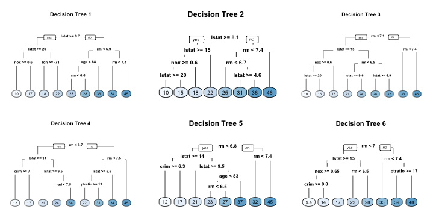

## Ensemble Methods

-   Single decision trees usually have **poor predictive performance**
-   **Ensemble Methods**: combine a collection of models to improve predictions
    -   Downside: reduced interpretability
-   This Lecture:
    -   Bagging
    -   Random Forests
-   Next time:
    -   Boosting

## Flexibility vs. Interpretability

## Bootstrapping

-   **Sampling with replacement** from the training data to create many "new" datasets
-   Each bootstrap sample is the same size as the original training set, but some observations are repeated and some are left out
-   On average, each bootstrap sample contains about **63.2%** of the unique observations from the original training set
-   The remaining **36.8%** are called **out-of-bag (OOB)** observations for that bootstrap sample

## Bagging {.smaller}

-   **Bootstrap aggregation** (**bagging**): a general procedure for reducing the variance of a statistical learning method
-   **Key insight**: Given $n$ independent observations $Z_1, \ldots, Z_n$ each with variance $\sigma^2$, the variance of their mean $\bar{Z}$ is $\sigma^2/n$
    +   **Averaging reduces variance**
-   **Idea**: build many trees and average their predictions
-   In practice we only have one training set... so we bootstrap

## Bootstrapping

## Bagging Algorithm {.smaller}

1.  Draw $B$ bootstrap samples from the training data
2.  Fit an unpruned tree $\hat{f}^{*b}$ on each bootstrap sample
3.  Average predictions across all trees:
$$\hat{f}_{\text{bag}}(x) = \frac{1}{B}\sum_{b=1}^{B}\hat{f}^{*b}(x)$$

-   Trees are **not pruned**: high variance but low bias -  averaging corrects the variance
-   **Classification**: take a **majority vote** across all $B$ trees

## Out-of-Bag Error Estimation {.smaller}

-   Fitting many trees is computationally expensive and adding cross-validation makes it more-so
-   On average, each bootstrap sample uses about **two-thirds** of the observations
-   The remaining **one-third** are called **out-of-bag (OOB)** observations for that tree
-   For each observation, average predictions from the trees where it was OOB
-   This gives a free performance estimate equivalent to LOOCV when $B$ is large
<!-- 
## Variable Importance Measures

-   Bagging improves accuracy at the cost of interpretability
-   We can still summarize which predictors matter most:
    +   At each split, record the reduction in the loss function (e.g., Gini impurity for classification) due to that variable
    +   Sum the total reduction across all splits and all trees for each variable
    +   A large value indicates an important predictor -->

## Bagging: Disadvantages

-   Reduces interpretability
-   Trees are **not fully independent**: all predictors are considered at every split of every tree
-   **Tree correlation**: trees from different bootstrap samples tend to have similar structure
    +   Limits how much variance can be reduced by averaging
-   **Random forests** address this by decorrelating the trees

## Bagging: Disadvantages

# Random Forests

## Random Forests {.smaller}

-   **Decorrelates** bagged trees $\Rightarrow$ further reduces variance
-   Same bootstrap sampling as bagging, but with a twist at each split:
    +   **Randomly select $m$ predictors** out of all $p$
    +   Only consider those $m$ predictors for the best split
    +   A fresh sample of $m$ predictors is drawn at **each** split
-   Typical choices: $m \approx \sqrt{p}$ for classification, $m \approx p/3$ for regression
-   Treat $m$ as a tuning parameter (`max_features` in sklearn)

. . .

-   Why does randomly excluding features reduce correlation?

# Bagging in Python

## Define and Fit the Bagging Model {.smaller}

Open `slides-19-practice.ipynb` and run the **Setup** cell, then the **Fit the Bagging Model** cell.

-   `BaggingClassifier` wraps any base estimator: in this case, an unpruned `DecisionTreeClassifier`
-   Key arguments:
    +   `n_estimators=500`: number of bootstrap trees - more is better (diminishing returns)
    +   `oob_score=True`: compute OOB accuracy for free during training
    +   `n_jobs=-1`: use all available CPU cores
-   Why do we use an **unpruned** tree as the base estimator?

## OOB Error and Test Accuracy {.smaller}

Run the **OOB Error and Test Accuracy** cell.

-   Compare `oob_score_` to test set accuracy:
    +   Do they agree closely?
    +   What does good agreement tell us about OOB as an estimator?
-   How does bagging accuracy compare to the single pruned tree from slides 18?

# Random Forests in Python

## Tune `max_features` {.smaller}

Run the **Tune `max_features`** cell - this may take a moment.

-   We compare: `1, 5, 10, 20, 'sqrt', 'log2', None`
-   `None` means all features are considered at every split... what does that reduce to?
-   While it runs: what do you expect the curve to look like as `max_features` increases from 1 to `None`?

## CV Results {.smaller}

Run the **CV Results** cell.

-   Describe the shape of the curve:
    +   What happens at `max_features=1` (extreme decorrelation)?
    +   What happens at `max_features=None` (no decorrelation)?
    +   Where is the sweet spot?
-   The shaded band shows ± 1 standard deviation across folds

## Best Parameters and Test Accuracy {.smaller}

Run the **Best Parameters and Test Accuracy** cell.

-   Record the best `max_features` value and the corresponding CV and test accuracies
-   Compare to:
    +   Bagging (OOB and test accuracy from above)
    +   The single classification tree from slides 18
-   Does random forests improve on bagging? By how much?

## Conceptual Questions

-   Why does randomly selecting $m$ features at each split reduce tree correlation?
-   When would you prefer bagging over random forests?

## Decision Trees / Bagging / Random Forests {.smaller}

| | Decision Tree | Bagging | Random Forest |
|--|--|--|--|
| Variance | High | Lower | Lowest |
| Bias | Low | Low | Low |
| Interpretable? | Yes | No | No |
| OOB error? | No | Yes | Yes |
| Key parameter | `ccp_alpha` | `n_estimators` | `max_features` |

# Recap

## Bagging and Random Forests: Key Ideas {.smaller}

**Bagging**

-   Fit many unpruned trees on bootstrap samples, then average (majority vote for classification)
-   Reduces variance without increasing bias
-   `oob_score=True` gives a free performance estimate equivalent to LOOCV
-   Trees are correlated — all features compete at every split

**Random Forests**

-   Same as bagging, but at each split only $m$ randomly chosen features are considered
-   Decorrelates trees: further reduces variance, often improves accuracy
-   Tune `max_features` ($\approx \sqrt{p}$ is a good default for classification)
-   Both support variable importance via mean decrease in impurity (MDI) — see lecture 20

**Big Picture**

-   Ensemble methods trade interpretability for accuracy: individual trees are readable, but 200 trees are not
-   Always compare against a single tuned tree: is the ensemble worth the complexity?
-   OOB error is a practical shortcut — use it instead of full CV when fitting many trees
